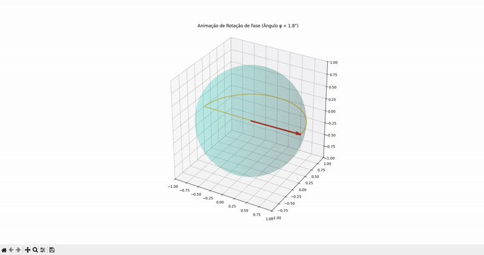

# Suíte de Simulações Quânticas em Python

Bem-vindo ao meu portfólio de Simulações Quânticas! Este repositório contém uma coleção de scripts interativos e educacionais desenvolvidos para explorar os fundamentos da Mecânica Quântica e da Computação Quântica.
Espero que você usuário se divirta e aproveite o bom uso dessas ferramentas, este projeto foi desenvolvido para ajudar os universitários e professores, e entreter os interessados na área de Exatas como Engenharia, Física, Matemática, Química ou TI. Considerado o MAIOR e o mais díficil projeto já feito...

## ⚙️ Requerimentos

Aqui está uma lista clara de todos os requerimentos necessários para rodar os meus projetos.

Requerimento Principal
Python: Versão 3.8 ou superior.

O pip (instalador de pacotes do Python) também é necessário, mas ele já vem incluído na maioria das instalações do Python.

-> Bibliotecas Python
Esta é a lista exata das bibliotecas que qualquer pessoa precisaria instalar para rodar todos os seus scripts.

qiskit: A biblioteca principal da IBM para computação quântica. É a base para criar e manipular os circuitos.

qiskit-aer: O componente da Qiskit que contém os simuladores de alta performance que usamos para executar os circuitos.

numpy: Fundamental para qualquer cálculo científico. Nós a usamos para todas as operações de álgebra linear e manipulação de vetores de estado.

matplotlib: A biblioteca que usamos para criar todas as visualizações 3D estáticas e a animação (Esfera de Bloch, Q-Sphere).

streamlit: A biblioteca usada para criar a aplicação web interativa do seu "Painel Quântico".

pandas: Usada no painel web para organizar os dados dos componentes (real e imaginário) antes de plotar.

altair: Usada no painel web para criar os gráficos de barras interativos.

## 🚀 Projetos

Esta suíte é dividida nos seguintes módulos:

1.  **[Simulador de Circuitos de 1 Qubit](./1_Simulador_Single_Qubit/)**: Uma ferramenta interativa via terminal para aplicar sequências de portas quânticas em um único qubit e visualizar o resultado na Esfera de Bloch, incluindo a análise de probabilidades.

2.  **[Laboratório de Emaranhamento](./2_Laboratorio_Emaranhamento/)**: Scripts para gerar o famoso Estado de Bell, demonstrando o conceito de emaranhamento quântico com a visualização avançada Q-Sphere e um experimento de medição.

3.  **[Animação de Rotação de Fase](./3_Animacao_Rotacao_Fase/)**: Uma simulação visual que mostra a evolução de um estado quântico em tempo real, animando a rotação de um qubit na Esfera de Bloch ao aplicar uma porta de fase. Recomendo que os aplicativos estejam tudo fechados e tenha um bom PC/Notebook pra rodar esta animação de rotação.

4.  **[Painel Interativo Web](./4_Painel_Interativo_Web/)**: Um protótipo de dashboard web construído com Streamlit que permite o controle interativo do estado de um qubit através de sliders, com visualizações matemáticas e gráficas atualizadas em tempo real. Para rodar este código, precisa ir para o terminal e digitar ''streamlit run painel_quantico.py''.

5.  **[Sequência de Portas](./5_Sequência_de_Portas/)**: O código cuida de toda a lógica de simulação, cálculo de probabilidades, visualização e interação com o usuário.

## 🛠️ Tecnologias Utilizadas
* PyCharm
* Git e Github
* Python
* Qiskit
* Matplotlib
* Streamlit
* Pandas & Altair

  
  
  
  
  
  
  
  

## 💡 Aprendizados
Este projeto foi desenvolvido por mim, uma jornada de aprendizado sobre os fundamentos da computação quântica, bem como sobre a arquitetura de software, o uso de ferramentas de IA Generativa para desenvolvimento (Gemini e GitHub Copilot) e a criação de ferramentas educacionais interativas.
